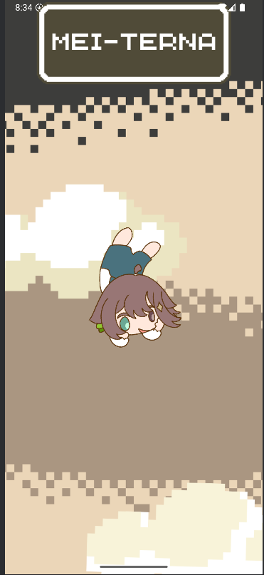
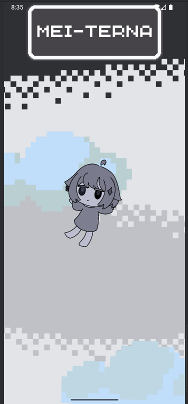

# 🔦 MEI-TERNA

¡Bienvenido a **MEI-TERNA**!  
Una app de linterna con tematica de Meica05

---

## 📱 Características

- Diseño visual inspirado en Meica
- Linterna ON/OFF con una sola pulsación
- Compatible con Android 7.0+

---

## 📷 Vista previa

  


---

## 📦 Descargar APK

> ⚠️ Si ves una advertencia de seguridad al instalar, ignórala. Esto es común en apps instaladas fuera de Google Play.

👉 [Haz clic aquí para descargar el APK](https://github.com/ishigami98/Mei-terna/releases/latest/download/Mei-terna.apk)

---

## 🚧 Código fuente

Todo el código está disponible en este repositorio. Puedes compilarlo tú mismo con Android Studio.

---

## 🛠️ Cómo compilar

1. Clona este repositorio:
   ```bash
   git clone https://github.com/ishigami98/Mei-terna.git
